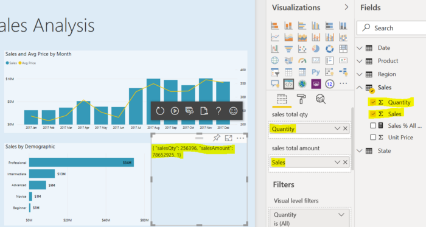

<!--
Copyright 2021 Ludan Stoecklé
SPDX-License-Identifier: CC-BY-4.0
-->
# Power BI custom visual demo using RosaeNLG

This repo contains a Power BI custom visual to add RosaeNLG ability to Power BI dashboards. It is useful if you wish to generate texts using NLG (Natural Language Generation) in your PowerBI dashboards.

Current status is **Proof Of Concept**: we show that is works. Uou should not see the current implementation as an off-the-shelf plugin but rather as a starting point for your own plugin, which will contain your custom RosaeNLG templates. 

Also check:
- [Generate textual narratives in Power BI using RosaeNLG](https://medium.com/@ludan.stoeckle/generate-textual-narratives-in-power-bi-using-rosaenlg-48f81c53db39) on Medium
- [RosaeNLG main doc](https://rosaenlg.org)


## Approach

It is based on the standard Power BI tutorial where RosaeNLG has been plugged on. It actually contains little new code compared to the tutorial.

Compared to other NLG approaches, the text rendering is made locally, directly in Power BI (Desktop or online version), **without any API call**. As no data is sent to an API over the internet, RosaeNLG is a very secure NLG solution for Power BI.


## How to create a Power BI plug-in using RosaeNLG

It takes 2 major steps:
- **Create the NLG templates:** define how to produce the texts based on the PowerBI data. Do this in a separate standard RosaeNLG project - see [RosaeNLG main doc](https://rosaenlg.org).
- **Package the NLG templates in a Power BI plug-in:** it essentially consists of defining the parameters of your plug-in so that it can be plugged in a PowerBI dashboard.

If the data needs to be analysed or prepared prior to text generation, it is convenient to do it in JavaScript, either in the NLG templates or in the Power BI plug-in.


## Running the Proof Of Concept

### Plug PowerBI and RosaeNLG together

Follow the [standard Power BI tutorial](https://docs.microsoft.com/en-us/power-bi/developer/visuals/custom-visual-develop-tutorial):
- *Setting up the developer environment:* follow as described in the tutorial
- *Creating a custom visual:* instead of using the CircleCard project, checkout this repo, then `run npm install` and `pbiviz start`
- *Adding visual elements:* follow as described in the tutorial

Obtain this result:


This Power BI plug-in takes 2 parameters: *sales total qty* and *sales total amount*. Let’s map them (drag and drop):



This simply means that both the Power BI plug-in and the RosaeNLG renderer are well plugged together, but this is not text generation yet.


### Render some texts

For this demo, we will use the [RosaeNLG browser IDE](https://rosaenlg.org/ide/index.html). For more complex projects, it is better to [use VSCode to author, version and compile your RosaeNLG templates](https://rosaenlg.org/rosaenlg/2.1.7/dev_experience.html#_large_projects_using_vscode).

This basic template contains 2 synonymic alternatives which essentially output the parameters in text:
```pug
- 
  // default value if not provided in the parameters
  data = data || {
    salesQty: 1000,
    salesAmount: 500000,
  }

synz
  syn
    | #[+value(data.salesQty)] items were sold
    | for a total amount of #[+value(data.salesAmount, {'FORMAT': '0a$'})]
  syn
    | total sales were #[+value(data.salesAmount, {'FORMAT': '0a$'})] for #[+value(data.salesQty)] items
| .
```
In the browser IDE, you should get this rendered text: **1,000 items were sold for a total amount of 500k$.**

Use **Export > Compiled JavaScript > for node.js** button to get the template compiled as a JavaScript function. Put the file in the powerbidemo folder and name it `compiledTemplateSales.js` (do not keep `fruits.js` or whatever).

Just refresh the dashboard and navigate in the data:


The text is still very basic, but there is not limit on the quality and complexity of the texts that you can generate!


## Inside the Power BI plug-in — how it works

In `externalJS` section of `pbiviz.json`, there is a reference to the already tinified version of the RosaeNLG renderer. Change the reference to change the language and the version. Version must be aligned with the RosaeNLG version in `package.json`.


In `visual.ts`, import both the RosaeNLG lib (`../node_modules/rosaenlg/dist/rollup/rosaenlg_tiny_en_US_XX.XX.XX.js`) and the compiled template (`../compiledTemplateSales.js`).

The `capabilities.json` file define the input parameters of your plug-in and your template. Complete that file to add parameters. Use `visual.ts` to make some mapping:

```
const data = {
 salesQty: dataView.categorical.values[0].values[0],
 salesAmount: dataView.categorical.values[1].values[0],
};
```

As an exercise you may add the sales date to the parameters and output it in the texts.

As any Power BI plug-in, it can be [packaged](https://docs.microsoft.com/en-us/power-bi/developer/visuals/custom-visual-develop-tutorial-format-options#packaging-the-custom-visual) and be run both in Desktop and Cloud versions of Power BI.

